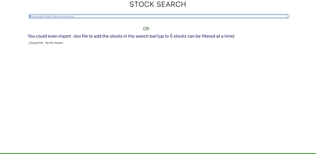

## Stock analysis application

A ReactJS application to do fundamental and technical analysis for a stock traded in India(Listed in NSE). Here you can search for a stock or import an excel file with all stock data and know latest information, Historical trends, fundamentals(Quarterly updated) and technical analysis for a stock. You can search up to 5 stocks at a time and compare their trends.

## Live Demo

  
You can [click here](https://ganeshdr.github.io/stock-analysis-app/) to take a look at the application.

## Installation

1. Clone the repo.
2. Make sure node version >= 8.12.0 and then `npm i`
3. `npm start`

This project was bootstrapped with [Create React App](https://github.com/facebook/create-react-app).

## Note

This repository uses [AlphaVantage](https://www.alphavantage.co/) as the data source. Although this provides free to use APIs, there are few restrictions on the usage of their APIs(like 5 calls per minute).

